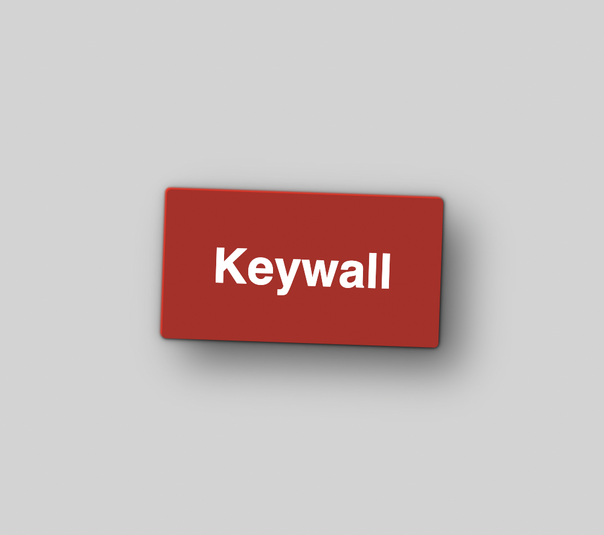

# KEYWALL

A small front end library for making component based apps with vanilla javascript. No bundler required. Just install or use a CDN and start using Keywall on any html project. Styles are scoped so no need to worry about style name collisions or overrides.

<div style="display:flex;justify-content:center;">
    
</div>

## Install

> CDN https://unpkg.com/keywall@latest
> <br>or<br>
> npm i keywall

## Basic usage

`index.html`

```html
<head>
    <script src="https://unpkg.com/keywall@latest"></script>
</head>
<body>
    <div id="app"></div>
    <script async>
        keywall('app', /* HTML */`
            <div class="title-container">
                <h1>Keywall</h1>
            </div>
            <style>
                * {
                    box-sizing: border-box;
                }
                body {
                    padding: 0;
                    margin: 0;
                    font-family: sans-serif;
                    display: flex;
                    justify-content: center;
                    align-items: center;
                    background-color: lightgray;
                    height: 100vh;
                }
                h1 {
                    color: white;
                }
                .title-container {
                    background-color: firebrick;
                    padding: .6rem 2rem;
                    border-radius: 3px;
                    box-shadow:
                    -1px -1px 1px rgba(255,0,0,1.85),
                    0 0 2px rgba(0,0,0,.85),
                    0 0 3px rgba(0,0,0,.55),
                    0 0 8px rgba(0,0,0,.35),
                    14px 14px 28px rgba(0,0,0,.55);
                    transform: rotate(2deg)
                }
            </style>
        `);
    </script>
</body>
```

## Advance usage

`app.js`

> Use Tobermory's [es6-String-Html vscode plugin](https://marketplace.visualstudio.com/items?itemName=Tobermory.es6-string-html) for syntax highlighting in your template strings.

```js
import { renderApp, defineComp } from './node_modules/keywall/lib.js';
import { Button } from './components/button.js';
import { Card } from './components/card.js';

function App(props) {
    const name = 'World';

    return defineComp({
        html: /* HTML */`
            <div class="title-container">
                <h1>Keywall</h1>
            </div>
            <main class="main-container">
                <h2 class="main-title">Hello ${name}</h2>
                ${Button({ name: 'Click Me', color: 'salmon' })} 
                ${Button({ name: 'Click You', color: 'lightgreen' })} 
                ${Card({ name: 'card', color: 'salmon', shadow: true })}
            </main>
        `,
        styles: /* CSS */`
            * {
                box-sizing: border-box;
            }
            body {
                padding: 0;
                margin: 0;
                font-family: sans-serif;
                display: flex;
                justify-content: center;
                align-items: center;
                background-color: lightgray;
                height: 100vh;
            }
            html {
                display: flex;
                align-items: center;
                justify-content: center;
            }
            h1 {
                color: white;
            }
            .title-container {
                background-color: firebrick;
                padding: .6rem 2rem;
                border-radius: 3px;
                box-shadow: 
                -1px -1px 1px rgba(255,0,0,1.85),
                0 0 2px rgba(0,0,0,.85),
                0 0 3px rgba(0,0,0,.55),
                0 0 8px rgba(0,0,0,.35),
                14px 14px 28px rgba(0,0,0,.55);
                transform: rotate(2deg)
            }
             .main-container {
                display: flex;
                flex-direction: column;
                place-items: center;
            }
             .main-title {
                background: lightblue;
                padding: 10px;
                border-radius: 3px;
            }
        `,
    });
}

renderApp('app', App());
```

`index.html`

```html
<body>
    <div id="app"></div>
    <script type="module" src="./app.js"></script>
</body>
```

> Note the install is from a full path ( './node_modules/keywall/lib.js' ). This is because we're not using a bundler.
